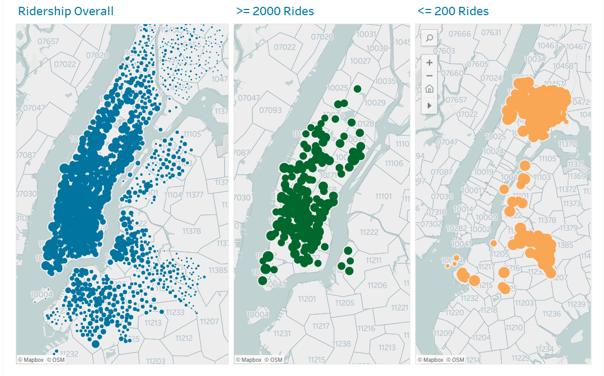
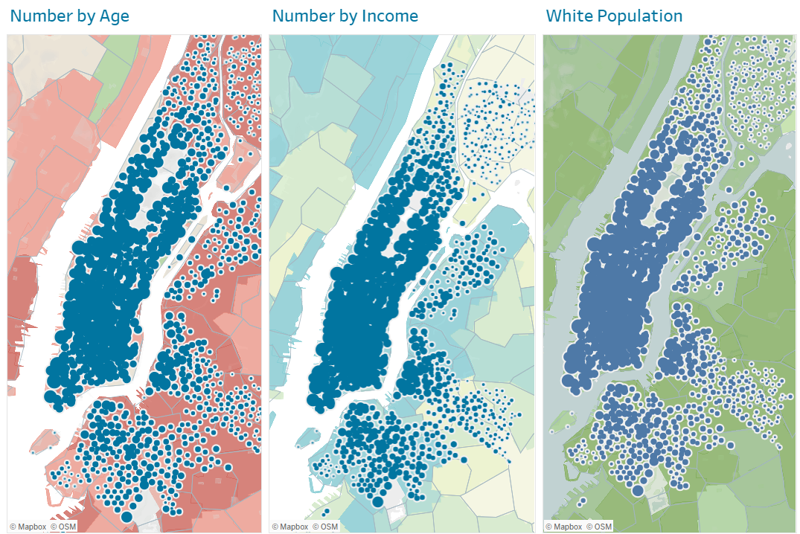
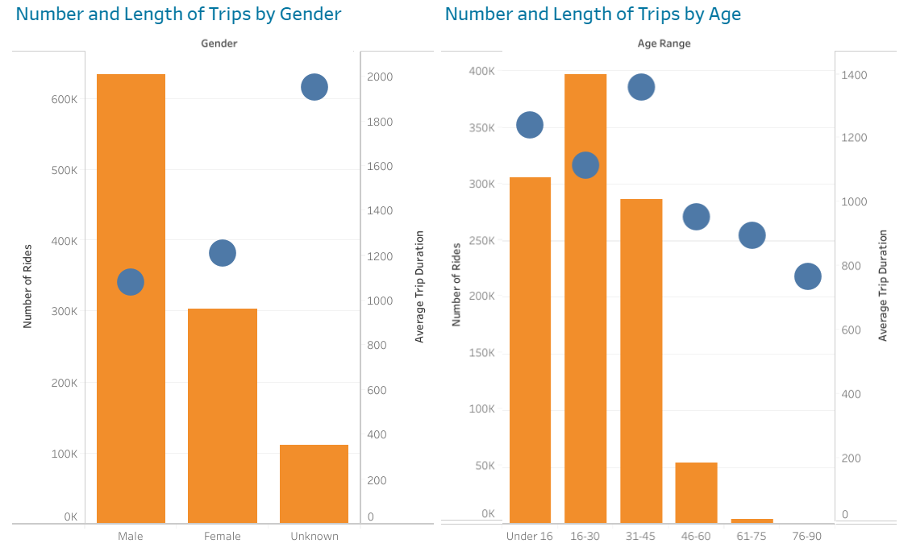

# City Bike Insights, Latest Month

## Overview
In this project I was asked to study the information available from the trip history logs for New York City's bike share program and create visualizations that reveal useful information about bike usage and ridership.  The full storyboard can be viewed at https://public.tableau.com/profile/michal.fineman#!/vizhome/tabHomeowrk/CityBikesStory.  A summary of findings appears below.

## Number of Trips v. Duration

The visualizations suggest a more or less inverse relationship between number of rides and the duration of those rides from any given start station, at least at the extremes.  The stations with the greatest number of rides (dashboard 1) during the last month are almost exclusively located in Manhattan, but this is also the area in which the station with the shortest rides are located (dashboard 4), while the stations with the fewest rides--mostly located in the outer boroughs, tend to have longer ride times.

The demographic data (dashboard 7) shows that the stations from which fewer but longer rides depart are in areas with less affluent populations.  One possible explanation is that folks in these areas have less money to spend on recreational rides, and, when they do use the bikes, it is for transportation purposes when they need to go somewhere too far to walk.  

The median age of the population in these zip codes is also younger than other areas of the city, and our data (dashboard 5) shows that younger age groups tend to take longer rides than older groups.

## Popularity of Start Stations and Destinations

There is considerable overlap in the most frequently used start and end stations (dashboards 1 and 2).  This makes sense in that, as noted above, the most frequently used stations are located in areas where riders tend to take short rides.  The table in dashboard 3 shows that often those rides are roundtrips back to the same station.

## Observations

The data for November indicates that City Bike riders in different parts of the city use the system in different ways, most likely to address different kinds of transportation needs.  In making decisions about resources and support for the various bike stations around the city, it would be wise to take all of these patterns into account.  We should not assume, for example, that users in areas with lower riderships are less in need of the service.  

At the same time, we can consider how to attract more potential riders in those areas.  Dashboards 6 and 7 indicate that men are more frequent riders than women and, although we do not collect race and ethnicity data on our users, census maps (dashboard #7) show that more heavily white neighborhoods see higher ridership.  Therefore, we might want to explore further the needs of women and minorities and plan outreach specifically to those groups. 
